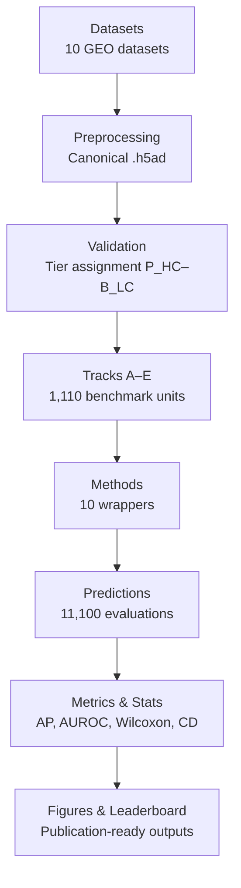

# REACH Benchmark

> **Rare-cell Evaluation Across Cancer Heterogeneity** — a systematic, reproducible benchmark for detecting rare malignant cells in single-cell RNA sequencing data.

[](https://github.com/jaswanthmoram/reach-rarecell-benchmark/actions/workflows/ci.yml)
[](https://www.python.org/downloads/)
[](LICENSE)
[](https://ghcr.io/jaswanthmoram/reach-rarecell-benchmark)
[](https://doi.org/10.5281/zenodo.19847108)

---

## At a glance

| | |
|---|---|
| **Datasets** | 10 scRNA-seq cohorts across 8 solid-tumour types and 2 blood malignancies |
| **Tracks** | 5 (controlled spike-ins · synthetic stress-test · null controls · natural prevalence · noisy labels) |
| **Methods** | 10 wrappers (6 ranked detectors · 2 baselines · 1 supervised ceiling · 1 exploratory) |
| **Benchmark units** | 1,110 |
| **Method–unit evaluations** | 11,100 |
| **Primary metric** | Average Precision (AP) on P_HC vs B_HC |

---

## What problem it solves

Rare malignant cell detection is critical for understanding tumour heterogeneity, but method comparison is hampered by inconsistent datasets, metrics, and evaluation protocols. REACH provides a standardised, reproducible benchmark with explicit file contracts, fixed random seeds, and comprehensive statistical evaluation.

---

## Architecture



See [`docs/architecture.md`](docs/architecture.md) for the full 12-phase design, file contracts, and data-flow diagrams.

---

## Quickstart

### Option 1: Local installation

```bash
git clone https://github.com/jaswanthmoram/reach-rarecell-benchmark.git
cd reach-rarecell-benchmark
python -m venv .venv
source .venv/bin/activate   # Windows: .venv\Scripts\activate
python -m pip install -e '.[dev]'
rcb create-toy-data
rcb smoke-test
```

Both commands should exit with code 0. `create-toy-data` generates ~300 synthetic cells in `data/toy/`; `smoke-test` runs the three naive baselines and prints a mini-leaderboard.

### Option 2: Docker (no installation needed)

```bash
# Pull the pre-built image
docker pull ghcr.io/jaswanthmoram/reach-rarecell-benchmark:latest

# Run smoke tests
docker run --rm ghcr.io/jaswanthmoram/reach-rarecell-benchmark:latest rcb smoke-test

# Run with mounted data directory
docker run --rm -v $(pwd)/data:/app/data ghcr.io/jaswanthmoram/reach-rarecell-benchmark:latest rcb create-toy-data
```

### Generate manuscript figures

Schematic figures (pipeline overview, track design, method audit) can be regenerated from the package without any data:

```bash
python scripts/generate_figures.py --pipeline --track-design --method-audit --output-dir figures/
# or: make figures
```

Data-driven figures (leaderboard, runtime, critical-difference) require evaluation results in `data/results/`.

> **Note on full pipeline commands:** `rcb run-phase`, `rcb run-track`, `rcb run-method`, `rcb evaluate`, `rcb figures`, `rcb verify-checksums`, and `rcb freeze-leaderboard` are scaffolded for v1.1. Full end-to-end rerun from raw data requires the archived datasets (Zenodo links below) and the documented environment.

---

## Result Preview

The public repository includes lightweight Phase 11 summary tables and Phase 12 PNG figures generated from the frozen CSV snapshot.


Key result paths:

| Path | Contents |
|---|---|
| `data/results/snapshots/paper_v1/` | Frozen CSV snapshot used for public reproducibility checks |
| `data/results/tables/phase11/` | Leaderboard, dataset summaries, rank tests, sensitivity summaries, and related Phase 11 CSV tables |
| `data/results/figures/phase12/` | GitHub-friendly PNG previews for leaderboard, sensitivity, null controls, runtime, pipeline, track design, and method audit |

Regenerate the public result bundle with:

```bash
python scripts/reproduce_from_snapshots.py
```

---

## Repository layout

```text
reach-rarecell-benchmark/
├── .github/          # CI, smoke, docs, and release workflows
├── configs/          # Dataset, method, metric, signature, and track configs
├── data/             # Directory skeleton, snapshot CSVs, and small public result bundle
├── docs/             # Architecture, installation, reproducibility, and extension guides
├── figures/          # Manuscript and schematic figures
├── logs/             # Runtime logs and execution records
├── requirements/     # Split dependency lists
├── scripts/          # Toy data, validation, orchestration, and snapshot utilities
├── setup/            # Optional environment setup notes
├── src/
│   └── rarecellbenchmark/
│       ├── ingest/       # Phase 1–2 data ingestion
│       ├── preprocess/   # Phase 2 preprocessing
│       ├── validate/     # Phase 3 validation and tier assignment
│       ├── tracks/       # Phases 4–8 track generation
│       ├── methods/      # Phase 9 wrappers
│       ├── evaluate/     # Phase 11 evaluation
│       ├── figures/      # Phase 12 figure generation
│       ├── execute/      # Pipeline execution helpers
│       ├── reports/      # Summary reports
│       ├── io/           # File I/O utilities
│       └── shared/       # Shared constants and schemas
├── tables/           # Notes for generated table outputs
├── tests/            # Unit and smoke tests
├── pyproject.toml    # Python package metadata
├── Dockerfile        # Container image
├── docker-compose.yml
├── Makefile          # Common development tasks
├── Snakefile         # Snakemake workflow scaffold
├── dvc.yaml          # DVC data-versioning pipeline
└── environment.yml   # Conda environment specification
```

---

## Benchmark tracks

| Track | Name | Description |
|-------|------|-------------|
| A | Controlled Real Spike-ins | Primary track: real P_HC cells spiked into real B_HC background at controlled prevalence (T1–T4) |
| B | Synthetic Splatter Stress-Test | Secondary track: synthetic data generated with Splatter; realism-audited |
| C | Null Controls | Diagnostic track: background-only units to test false-positive calibration |
| D | Natural Blood/CTC Prevalence | Primary track: natural prevalence in blood-origin datasets without artificial spike-ins |
| E | Noisy-Label Robustness | Restricted track: label corruption while expression is held constant (supervised methods only) |

---

## Data availability

All raw datasets are publicly available from GEO (accessions listed below). Processed datasets, track units, predictions, and frozen results are archived on Zenodo.

**What lives where:**

| What | Where |
|------|-------|
| Code, configs, docs, toy data | This GitHub repository |
| Processed `.h5ad` datasets (7.3 GB) | Zenodo [](https://doi.org/10.5281/zenodo.19850652) |
| Track Units A–C (9.7 GB) | Zenodo [](https://doi.org/10.5281/zenodo.19850972) |
| Track Units D–E + Predictions (2.2 GB) | Zenodo [](https://doi.org/10.5281/zenodo.19851287) |
| Frozen metrics & results (5.2 MB) | Zenodo [](https://doi.org/10.5281/zenodo.19850646) |

Code releases are archived automatically via the GitHub–Zenodo integration. The concept DOI [10.5281/zenodo.19847108](https://doi.org/10.5281/zenodo.19847108) always resolves to the latest version.

---

## Datasets

| Dataset | Cancer type | Cells | Platform | Accession |
|---|---|---|---|---|
| hnscc_puram | Head & neck SCC | 5,902 | SMART-seq2 | GSE103322 |
| ov_izar_tirosh | Ovarian cancer (ascites) | 9,482 | 10x Chromium | GSE146026 |
| hcc_wei | Hepatocellular carcinoma | 19,382 | 10x Chromium | GSE149614 |
| luad_laughney | Lung adenocarcinoma | 33,782 | 10x Chromium | GSE123902 |
| rcc_multi | Renal cell carcinoma | 33,574 | 10x Chromium | GSE159115 |
| pdac_peng | Pancreatic ductal adenocarcinoma | 123,488 | 10x Chromium | GSE202051 |
| crc_lee | Colorectal cancer | 55,551 | 10x Chromium | GSE132465 |
| bcc_yost | Basal cell carcinoma | ~47,000 | 10x Chromium | GSE123813 |
| mm_ledergor | Multiple myeloma | 31,181 | 10x Chromium | GSE161801 |
| breast_ctc_szczerba | Breast cancer CTCs | 357 | SMART-seq2 | GSE109761 |

---

## Included methods

| Method | Status | Track(s) | Notes |
|---|---|---|---|
| FiRE | Full | A,B,C,D,E | R package |
| DeepScena | Full | A,B,C,D,E | GPU optional |
| RareQ | Full | A,B,C,D,E | Quantile-based rarity |
| cellsius | Full | A,B,C,D,E | R-based rarity statistic |
| scCAD | Full | A,B,C,D,E | Anomaly-based scorer |
| scMalignantFinder | Full | A,B,C,D,E | Fast Python scorer |
| CaSee | Exploratory | A,B,C,D,E | Faithful method (Yu et al., 2022) |
| random_baseline | Baseline | A,B,C,D,E | Random floor |
| expr_threshold | Baseline | A,B,C,D,E | Naive biological signal |
| hvg_logreg | Ceiling | A,B,C,E | Supervised in-sample oracle |

---

## Metrics and leaderboard rules

- **Primary metric:** Average Precision (AP) on P_HC vs B_HC, fallback-filtered.
- **Secondary metric:** AUROC.
- **Operational metrics:** F1@top-k, Precision@k, Recall@k, Balanced Accuracy, Runtime.
- **Stratification:** Results are stratified by prevalence tier (T1–T4) and platform (SMART-seq2 vs 10x Chromium).
- **Statistical tests:** Friedman + Iman-Davenport correction; Wilcoxon signed-rank with Benjamini-Hochberg FDR; bootstrap 95 % CIs on ranks.
- **Visualisation:** Critical Difference (CD) diagrams.

See [`docs/metrics.md`](docs/metrics.md) for full definitions and formulas.

---

## How to regenerate the benchmark

See [`docs/benchmark_regeneration.md`](docs/benchmark_regeneration.md) for step-by-step instructions to reproduce the full pipeline from raw data through figures.

---

## How to add a new method

See [`docs/adding_new_method.md`](docs/adding_new_method.md) for the wrapper interface, smoke-test protocol, and evaluation steps.

---

## Citation

If you use REACH in your research, please cite it using the metadata in [`CITATION.cff`](CITATION.cff):

```
Moram, V. S. J. (2026). REACH: A Reproducible Benchmark for Rare Malignant Cell Detection
in scRNA-seq Data. https://github.com/jaswanthmoram/reach-rarecell-benchmark.
DOI: 10.5281/zenodo.19847108
```

---

## License and contributions

REACH is released under the [MIT License](LICENSE). Contributions are welcome — please see [`CONTRIBUTING.md`](CONTRIBUTING.md) for guidelines.
